# 🚀 Awesome Queue Management Platform

<p align="center">
  
</p>

<p align="center">
  <a href="https://github.com/ishandutta2007/Awesome-Awesome-Awesome"></a><a href="https://discord.gg/jc4xtF58Ve"></a>
  <a href="https://github.com/ishandutta2007/Awesome-Queue-Management-Platform/stargazers"></a>
  <a href="https://github.com/ishandutta2007/Awesome-Queue-Management-Platform/network/members"></a>
  <a href="https://github.com/ishandutta2007/Awesome-Queue-Management-Platform/issues"></a>
  <a href="https://github.com/ishandutta2007/Awesome-Queue-Management-Platform/blob/main/LICENSE"></a>
  <a href="https://github.com/ishandutta2007"></a>
</p>

---

## 🧭 Top Queue Management Platforms Ecosystem

> 🌟 **Curated List of SaaS Products & Open-Source GitHub Projects**  
> *A comprehensive directory focusing on Customer Queuing, Virtual Queues, Appointment Scheduling, Digital Ticketing, Self-Service Kiosks, Waiting-Room Displays, and Waiting-Time Optimization.*  
> 📅 **Last updated: August 2026**

This repository tracks top-tier **SaaS/hosted platforms** and **open-source repositories** designed for **Queue Management Systems (QMS)** and **Customer Flow Management (CFM)**. These platforms empower hospitals, banks, retail chains, universities, airports, and public service centers to streamline customer check-in, issue mobile & paper tickets, orchestrate virtual waiting rooms, route visitors to available service counters, broadcast live queue status to digital signage, predict wait times using AI, send automated SMS notifications, and analyze staff operations.

---

## 📑 Table of Contents

* [📊 Market Size & Industry Structure](#-market-size--industry-structure)
* [☁️ SaaS / Hosted Platforms](#️-saashosted-platforms)
* [💻 Open-Source GitHub Projects](#-open-source-github-projects)
* [🌟 Additional Strong Open-Source Options](#-additional-strong-open-source-options)
* [🏗️ Open-Source QMS Architecture](#️-open-source-qms-architecture)
* [📈 Star History](#-star-history)
* [🤝 How to Contribute](#-how-to-contribute)
* [⚠️ Disclaimer](#️-disclaimer)

---

## 📊 Market Size & Industry Structure

> 💡 **Market Size & Structure**: The global Queue Management System market is valued at approximately **$880 Million to $1.2 Billion** (for dedicated QMS software & virtual queuing solutions) and expands to over **$40+ Billion** when including integrated hardware kiosks, intelligent digital signage, and crowd-density monitoring infrastructure. The sector is **moderately fragmented**—while legacy enterprise leaders (such as Qmatic, Wavetec, and Q-nomy) hold substantial enterprise footprint, no single vendor commands a winner-take-all monopoly, leaving significant room for agile cloud-native SaaS disruptors (like Waitwhile and Qminder) and self-hosted open-source architectures.

---

## ☁️ SaaS/Hosted Platforms

The following SaaS and enterprise-hosted platforms are sorted in descending order by estimated company size (annual revenue / valuation):

| Platform | Description | Estimated Size (Revenue / Valuation) | Starting Pricing | Free Tier / Free Trial Limits |
| :--- | :--- | :--- | :--- | :--- |
| **[Qmatic](https://www.qmatic.com/)** | Enterprise customer journey and queue-management platform supporting ticketing, appointment scheduling, digital queuing, kiosks, customer-flow orchestration, and analytics. | **~$33M+ ARR** (Acquired by Valsoft Corporation) | **Custom enterprise subscription** (quote-based upon consultation; typical deployments start ~$500–$1,000/mo depending on location & volume) | **Free live interactive demo & guided product tour** upon request (no self-serve free trial or free tier). |
| **[Wavetec](https://www.wavetec.com/)** | Global customer-experience and queue-management hardware/software provider offering kiosks, digital signage, ticketing, virtual queues, and customer-flow solutions (Spectra). | **~$25M – $50M ARR** (Global enterprise footprint) | **Custom quote-based pricing** (tiered by hardware integrations, branch size, and deployment scope) | **Free live demo consultation** upon request (no self-serve free trial or free tier). |
| **[Q-nomy](https://www.q-nomy.com/)** | Enterprise customer-flow management platform covering queue management, appointment scheduling, virtual queuing, workforce coordination, and branch optimization (Q-Flow). | **~$15M+ ARR** (Enterprise market leader) | **Custom quote-based pricing** (tailored by branch count, concurrent users, and deployment model) | **Free guided demo** upon request (no self-serve free trial or free tier). |
| **[QLess](https://www.qless.com/)** | Virtual queue and appointment-management platform designed to eliminate physical waiting lines through mobile check-in, digital ticketing, and notifications. | **~$9.1M ARR** (Enterprise/Gov/Education focus) | **Custom quote-based pricing** (enterprise contracts typically start from ~$60–$150/month per location depending on service scale) | **Free guided product demo** upon request (no automated free trial or free tier). |
| **[Qudini](https://www.qudini.com/)** | Retail customer journey and queue-management platform supporting virtual queues, appointments, customer notifications, kiosks, and in-store service optimization. | **~$6.7M ARR** (Acquired by Verint Systems) | **Custom enterprise quote-based pricing** (via Verint solutions) | **Free guided walkthrough & demo** upon request (no self-serve free trial or free tier). |
| **[Waitwhile](https://waitwhile.com/)** | Cloud-based waitlist, queue, appointment, and customer-flow platform with virtual queuing, automated SMS/email notifications, booking, and analytics. | **~$4.3M – $9M ARR** ($24M total VC funding raised) | Starts at **$31/month** (Starter tier billed annually) or **$39/month** (monthly billing) | **Free Forever plan**: 50 visits/month, 1 location, waitlist & appointment workflows, email notifications. Paid plans offer a 14-day free trial. |
| **[Livewire Digital](https://www.livewiredigital.com/)** | Enterprise queue-management and interactive kiosk solutions for managing customer waiting lines, ticketing, and service counters. | **~$3M – $4M ARR** (Acquired by REDYREF Interactive Kiosks) | **Custom quote-based pricing** (custom hardware + software kiosk deployments) | **Free consultation & demo** upon request (no self-serve free trial or free tier). |
| **[Qminder](https://www.qminder.com/)** | Cloud-based queue management and customer-flow platform providing digital check-in, virtual queues, customer notifications, staff dashboards, and service analytics. | **~$1.9M ARR** (€3M funding raised in 2024) | Starts at **$429/month** (Starter plan billed annually) | **14-day free trial** with full access to all features (no perpetual free tier). |
| **[Skiplino](https://www.skiplino.com/)** | Mobile-first digital queue and appointment-management platform enabling customers to join queues remotely, receive notifications, and monitor their position. | **~$1M – $2M ARR** ($4.86M total funding raised) | Starts at **$99/month** (Branch plan billed annually) | **7-day free trial** with full platform capabilities, no credit card required (no perpetual free tier). |

---

## 💻 Open-Source GitHub Projects

The following open-source queue management systems, ticketing engines, and customer flow applications are sorted in descending order by GitHub Stars:

* **[SimplQ — SimplQ/simplQ-frontend](https://github.com/SimplQ/simplQ-frontend)** [](https://github.com/SimplQ/simplQ-frontend/stargazers)  
  *Modern and fully web-based free queue management open-source software.* Provides real-time virtual queue joining, customer token tracking, and streamlined staff counter dispatching.

* **[FQM — mrf345/FQM](https://github.com/mrf345/FQM)** [](https://github.com/mrf345/FQM/stargazers)  
  *Web-based queue management system built with Python Flask, Bootstrap, and jQuery.* Features multi-service queues, ticket printing, and real-time counter calling.

* **[ZeroQueue — hazim-j/zeroqueue](https://github.com/hazim-j/zeroqueue)** [](https://github.com/hazim-j/zeroqueue/stargazers)  
  *A low-code queue management system.* Enables rapid creation and deployment of custom queue flows, tokens, and multi-desk operational screens.

* **[AuroQueue — 2color/auroqueue](https://github.com/2color/auroqueue)** [](https://github.com/2color/auroqueue/stargazers)  
  *Open-source queue management system.* Offers digital ticket generation, queue monitoring, and intuitive customer display boards.

* **[Smart Digital Queue Tracker — ancy3115/Smart-Digital-Queue-Tracker](https://github.com/ancy3115/Smart-Digital-Queue-Tracker)** [](https://github.com/ancy3115/Smart-Digital-Queue-Tracker/stargazers)  
  *Smart slot-based digital queue management system.* Implements slot-based queue scheduling, live position tracking, and waiting-time reduction logic.

* **[Number Calling System — glitter1105/queue](https://github.com/glitter1105/queue)** [](https://github.com/glitter1105/queue/stargazers)  
  *Full-featured queue management and number calling system (排队叫号系统).* Supports ticket dispensing, counter calling consoles, voice audio calling, and live waiting-room displays.

* **[SmartQueue AI — ARULSEBASTIN71/SmartQueue](https://github.com/ARULSEBASTIN71/SmartQueue)** [](https://github.com/ARULSEBASTIN71/SmartQueue/stargazers)  
  *AI-powered smart queue management system designed to reduce waiting times.* Supports appointment booking, QR-based digital tokens, live queue tracking, admin dashboards, and crowd prediction.

* **[QueueSG — opengovsg/queuesg](https://github.com/opengovsg/queuesg)** [](https://github.com/opengovsg/queuesg/stargazers)  
  *Open-source queue management application by Open Government Products Singapore.* Utilizes Trello as a backend for lightweight, rapid deployment of pop-up queues with SMS alerts.

* **[QueueManage — GuyKossi/queueManage](https://github.com/GuyKossi/queueManage)** [](https://github.com/GuyKossi/queueManage/stargazers)  
  *Complete queue management system.* Handles tickets, service desks, operators, waiting-room display screens, and real-time audio announcements.

* **[QMS OpenSource — qms-opensource/queuemanagementsystem](https://github.com/qms-opensource/queuemanagementsystem)** [](https://github.com/qms-opensource/queuemanagementsystem/stargazers)  
  *Laravel & MySQL queue-management application tailored for clinics and hospitals.* Includes administrator, receptionist, and doctor calling workflows with SMS notifications.

* **[HQMS — camsvn/HQMS](https://github.com/camsvn/HQMS)** [](https://github.com/camsvn/HQMS/stargazers)  
  *Hospital Queue Management System.* Tailored for outpatient registration, doctor consultation queues, and clinic waiting-room dispatching.

* **[Qsee — StuDownie/Qsee](https://github.com/StuDownie/Qsee)** [](https://github.com/StuDownie/Qsee/stargazers)  
  *Real-time queue-management application.* Features a customer kiosk, agent calling screen, waiting-room display, ticket printing, and Web Speech API automated announcements.

* **[Spring Boot QMS — sdley/queue-management-system](https://github.com/sdley/queue-management-system)** [](https://github.com/sdley/queue-management-system/stargazers)  
  *Enterprise Java queue management backend.* Implements service and location routing, customer queue tracking, operator controls, and administrator analytics in Spring Boot & MySQL.

* **[Blazor Queue System — kaizhou8/QueueManagementSystem](https://github.com/kaizhou8/QueueManagementSystem)** [](https://github.com/kaizhou8/QueueManagementSystem/stargazers)  
  *Blazor-based queue platform designed for hospitals, banks, and government service environments.* Includes display screens, staff consoles, mobile QR tickets, priority queues, and dynamic counter allocation.

* **[Docker Self-Hosted Queue — mrkaqz/queue](https://github.com/mrkaqz/queue)** [](https://github.com/mrkaqz/queue/stargazers)  
  *Lightweight Docker-based queue system.* Built with TV displays, operator controls, customer QR tracking, PWA mobile push notifications, queue holds, and POS integration.

* **[Queue System — krispx2811/Queue-System](https://github.com/krispx2811/Queue-System)** [](https://github.com/krispx2811/Queue-System/stargazers)  
  *Real-time queue-management application with multi-counter support, kiosks, QR ticket tracking, voice text-to-speech announcements, and waiting-room display layouts.*

* **[Queue Management System — qtrcipher/queue-management-system](https://github.com/qtrcipher/queue-management-system)** [](https://github.com/qtrcipher/queue-management-system/stargazers)  
  *Self-hosted queue-management system supporting multi-branch queues, kiosk check-in, appointments, QR/web joining, staff counter workflows, public displays, and WebSockets (Apache-2.0).*

* **[Full-Stack QMS — Yayanjay/queue-management-system](https://github.com/Yayanjay/queue-management-system)** [](https://github.com/Yayanjay/queue-management-system/stargazers)  
  *Queue-management system with customer kiosk, staff dashboard, real-time display, ticket printing, administration, WebSockets, and TTS calling.*

* **[Modular QMS — lhrmgs007/Queue-Management-System](https://github.com/lhrmgs007/Queue-Management-System)** [](https://github.com/lhrmgs007/Queue-Management-System/stargazers)  
  *Modular queue-management platform featuring queue/service/counter/ticket management, QR tickets, calling systems, displays, and reporting.*

* **[Local-Network QMS — adriancs2/Queue-Management-System](https://github.com/adriancs2/Queue-Management-System)** [](https://github.com/adriancs2/Queue-Management-System/stargazers)  
  *Self-contained queue ticket system supporting take-a-number kiosks, live display boards, operator consoles, offline local-network operation, and QR tracking.*

* **[Smart QMS — vivek-0320/Smart-Queue-Management-System](https://github.com/vivek-0320/Smart-Queue-Management-System)** [](https://github.com/vivek-0320/Smart-Queue-Management-System/stargazers)  
  *Queue system with customer kiosk, staff counters, admin dashboards, display boards, priority queues, ticket transfer, analytics, and WebSockets.*

---

## 🌟 Additional Strong Open-Source Options

* **[SimplQ](https://github.com/SimplQ/simplQ-frontend)** — Lightweight, modern web-based virtual queuing solution.
* **[FQM](https://github.com/mrf345/FQM)** — Python/Flask-based queue management foundation with counter calling.
* **[ZeroQueue](https://github.com/hazim-j/zeroqueue)** — Low-code platform for building customized queue workflows.
* **[SmartQueue AI](https://github.com/ARULSEBASTIN71/SmartQueue)** — AI-driven queue management with crowd prediction and QR ticketing.
* **[QueueSG](https://github.com/opengovsg/queuesg)** — Lightweight Trello-backed queue architecture for temporary and pop-up events.
* **[Qsee](https://github.com/StuDownie/Qsee)** — Simple kiosk + agent + waiting-room display implementation with Web Speech API calling.
* **[QMS OpenSource](https://github.com/qms-opensource/queuemanagementsystem)** — Healthcare-oriented queue-management foundation with SMS notifications.
* **[HQMS](https://github.com/camsvn/HQMS)** — Outpatient and clinic queue management foundation.
* **[Queue Management System (qtrcipher)](https://github.com/qtrcipher/queue-management-system)** — Multi-branch, kiosk, staff calling, and display architecture.
* **[Self-Hosted Queue (mrkaqz)](https://github.com/mrkaqz/queue)** — Compact Docker and PWA-oriented option for small retail counters.

---

## 🏗️ Open-Source QMS Architecture

Many open-source queue management projects implement the full end-to-end customer journey workflow:

```
[Digital Kiosk / QR Check-In] ➡️ [Virtual Queue Routing] ➡️ [Counter Assignment] ➡️ [Staff Calling Screen] ➡️ [Live TV Display] ➡️ [SMS / Audio Notification] ➡️ [Analytics & SLA]
```

### Key Technical Capabilities:
* 📱 **Digital Check-In**: Kiosk touchscreen, QR code scanning, web pre-registration, or receptionist intake.
* 🎫 **Virtual Queues**: Enables customers to wander freely while tracking real-time queue position on mobile devices.
* 📅 **Appointment Scheduling**: Blends pre-booked calendar appointments with walk-in ticketing.
* 🔀 **Intelligent Routing**: Directs visitors according to service type, branch location, employee skillset, and VIP priority.
* 🏷️ **Ticket Operations**: Support for calling, recalling, transferring, holding, skipping, and completing service tickets.
* 📺 **Digital Signage & TV Displays**: High-definition waiting-room boards presenting active tickets, counter numbers, and media announcements.
* 🗣️ **Automated Voice Announcements**: Web Speech API & Text-to-Speech (TTS) integration for multi-lingual calling.
* ⏱️ **Estimated Wait Time (EWT)**: Algorithmic wait-time calculation based on queue length, historical duration, and active counters.
* 📊 **Operational Analytics**: Reports on average wait time, service transaction duration, abandonment rates, and peak hour trends.

---

## 📈 Star History

[](https://star-history.dera.page/#ishandutta2007/Awesome-Queue-Management-Platform&type=date&legend=top-left)

---

## 🤝 How to Contribute

1. 🍴 Fork the repository.
2. 📝 Add or update entries in `README.md` following the established format and table structures.
3. 🔗 Include: platform name, official URL, descriptive overview, pricing details, and free tier/trial limits.
4. ⭐ For open-source projects, ensure public GitHub repository links and valid star badges are included.
5. 📬 Submit a Pull Request with a clear description of the proposed addition.

⭐ **Star this repository if you find it helpful for your customer experience or queue engineering projects!**

---

## ⚠️ Disclaimer

* 🔍 This is a **community-curated** directory for informational and educational purposes.
* 🏢 Commercial pricing, plans, and enterprise quotes are subject to change by respective vendors.
* 🛡️ Open-source self-hosted systems require proper production hardening, data privacy compliance, and reliable hosting infrastructure before deployment in mission-critical environments.

---

<p align="center">
  <b>Built for hospitals 🏥, banks 🏦, government service centers 🏛️, retail stores 🛍️, airports ✈️, universities 🎓, and customer experience teams worldwide.</b><br />
  <i>Making customer queues smarter, faster, and more accessible.</i>
</p>
